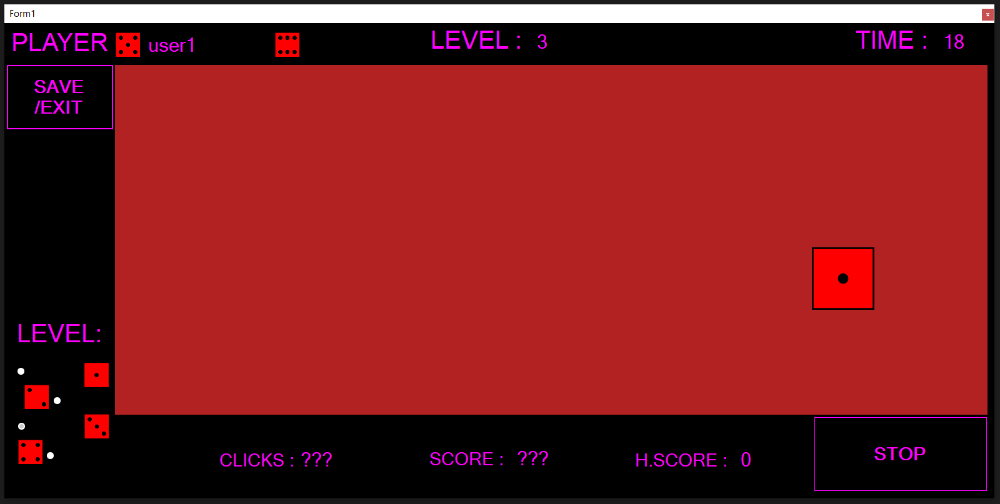

# Dice Game App 

## Project in C# WinForms

**A simple quick reaction game.**

## Rules
Random images re-spawn in random position on screen.    
Each image has a value  
By clicking an image you increase your score by the value of the clicked image

## Levels
**Level 1**
* Time : 30s
* Re-spawn Times : 1/s
* Background color change : NO
* Miss-click penalty : NO

**Level 2**
* Time : 20s
* Re-spawn Times : 1/s
* Background color change : NO
* Miss-click penalty : NO

**Level 3**
* Time : 20s
* Re-spawn Times : 2/s
* Background color change : 2/s
* Miss-click penalty : -2pt

**Level 4**
* Time : 14s
* Re-spawn Times : 3/s
* Background color change : 3/s
* Miss-click penalty : -4pt

## Gallery

